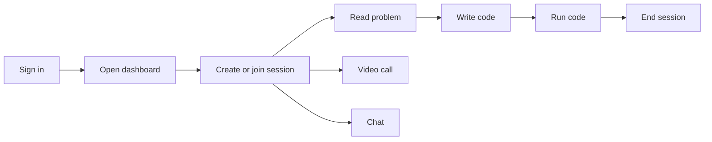
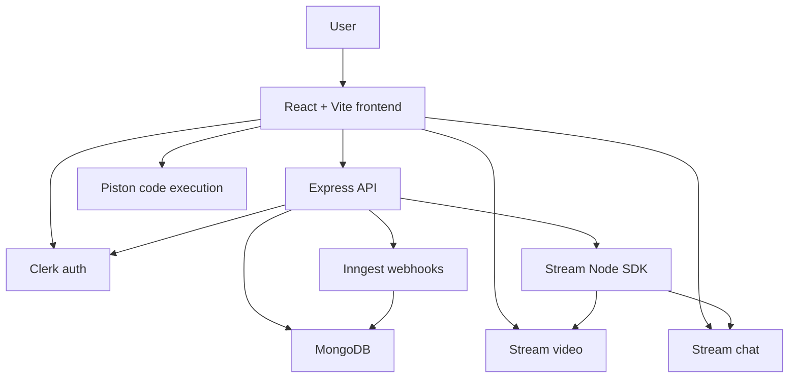
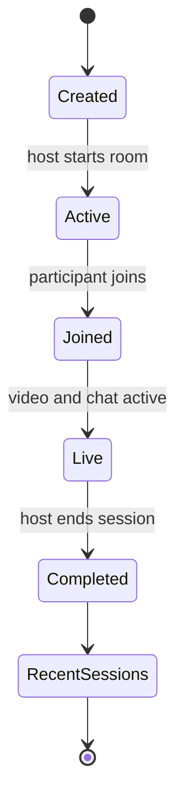

# Intervo

> A real-time coding interview platform where developers can solve problems, run code, video call, and chat inside one focused workspace.


## The vibe

Intervo is built for live coding practice without the tab chaos.

No jumping between a meeting app, a notes app, a coding website, and a chat window. Intervo puts the interview room, problem statement, code editor, output panel, video call, and chat in one place.

It is made for:

- 👨‍💻 mock coding interviews
- 🤝 pair programming practice
- 📚 DSA problem solving
- 🎥 live technical sessions
- ⚡ focused interview prep

## What it does

| Feature | What you get |
|---|---|
| 🔐 Authentication | Sign in securely with Clerk |
| 🧭 Dashboard | See active sessions, recent sessions, and stats |
| 🏁 Create sessions | Start a coding room with a selected problem |
| 🚪 Join sessions | Enter open live rooms from the dashboard |
| 🎥 Video calls | Talk face-to-face inside the session |
| 💬 Session chat | Message during the interview |
| 🧠 Practice problems | Solve curated coding questions |
| 📝 Code editor | Write code in a Monaco-powered editor |
| ▶️ Code runner | Execute code using the Piston API |
| 🌍 Multi-language support | JavaScript, Python, and Java |
| 📌 Session history | View completed sessions in recent activity |

## How the app flows



## Architecture



## Session lifecycle



## Tech stack

### Frontend

- ⚛️ React
- ⚡ Vite
- 🎨 Tailwind CSS
- 🌼 DaisyUI
- 🧭 React Router
- 🔄 TanStack Query
- 📝 Monaco Editor
- 🔐 Clerk React
- 🎥 Stream Video React SDK
- 💬 Stream Chat React
- 📡 Axios

### Backend

- 🟢 Node.js
- 🚀 Express
- 🍃 MongoDB
- 🧬 Mongoose
- 🔐 Clerk Express
- 🌊 Stream Node SDK
- ⚡ Inngest
- 🌍 CORS
- 🔒 Dotenv

### External services

| Service | Purpose |
|---|---|
| Clerk | Authentication |
| MongoDB | Database |
| Stream | Video calls and chat |
| Piston | Code execution |
| Inngest | Clerk user webhook handling |

## Project structure

```bash
Intervo/
├── backend/
│   ├── src/
│   │   ├── controllers/
│   │   ├── lib/
│   │   ├── middleware/
│   │   ├── models/
│   │   ├── routes/
│   │   └── server.js
│   └── package.json
│
├── frontend/
│   ├── public/
│   ├── src/
│   │   ├── api/
│   │   ├── components/
│   │   ├── data/
│   │   ├── hooks/
│   │   ├── lib/
│   │   ├── pages/
│   │   ├── App.jsx
│   │   └── main.jsx
│   └── package.json
│
└── README.md
```

## Environment variables

Create `backend/.env`:

```env
PORT=5001
NODE_ENV=development
CLIENT_URL=http://localhost:5173
DB_URL=your_mongodb_connection_string

CLERK_SECRET_KEY=your_clerk_secret_key
CLERK_PUBLISHABLE_KEY=your_clerk_publishable_key

STREAM_API_KEY=your_stream_api_key
STREAM_API_SECRET=your_stream_api_secret

INNGEST_EVENT_KEY=your_inngest_event_key
INNGEST_SIGNING_KEY=your_inngest_signing_key
```

Create `frontend/.env`:

```env
VITE_API_URL=http://localhost:5001/api
VITE_CLERK_PUBLISHABLE_KEY=your_clerk_publishable_key
VITE_STREAM_API_KEY=your_stream_api_key
```

Do not push real `.env` values to GitHub.

## Run locally

Clone the repo:

```bash
git clone https://github.com/your-username/Intervo.git
cd Intervo
```

Install backend dependencies:

```bash
cd backend
npm install
```

Install frontend dependencies:

```bash
cd ../frontend
npm install
```

Start the backend:

```bash
cd backend
npm run dev
```

Start the frontend:

```bash
cd frontend
npm run dev
```

Open:

```text
http://localhost:5173
```

## API routes

| Method | Route | Description |
|---|---|---|
| GET | `/health` | Check backend status |
| POST | `/api/sessions` | Create a coding session |
| GET | `/api/sessions/active` | Get active sessions |
| GET | `/api/sessions/my-recent` | Get recent completed sessions |
| GET | `/api/sessions/:id` | Get one session |
| POST | `/api/sessions/:id/join` | Join a session |
| POST | `/api/sessions/:id/end` | End a session |
| GET | `/api/chat/token` | Get Stream token |

## Main screens

- 🏠 Landing page
- 📊 Dashboard
- 📚 Problems page
- 🧑‍💻 Problem workspace
- 🎥 Live session room
- 💬 Chat panel
- ▶️ Output panel

## Why Intervo hits different

Intervo keeps the full interview flow in one place:

- problem statement on one side
- code editor and output ready to go
- video call for real conversation
- chat for quick messages
- dashboard to jump into sessions fast

Simple, focused, and actually useful for practice.
